# Research Memo v1: AI Exposure and Labor-Market Outcomes in Spain

## 1. Introduction

This memo assesses whether occupations with higher exposure to recent advances in artificial intelligence experienced different labor-market trajectories after the diffusion of generative AI. The central research question is whether AI exposure is associated with increases in registered unemployment, changes in hiring, or broader labor-market reallocation across Spanish occupations.

The analysis uses monthly SEPE occupation-level panel data matched to an AI exposure measure adapted to the Spanish CNO4 occupational classification. The main empirical comparison is between CNO4 occupations with high observed AI exposure and occupations with zero measured exposure. The baseline design follows a difference-in-differences logic: compare high-exposure and zero-exposure occupations before and after September 2022, the beginning of the generative-AI diffusion window used in the project. The memo summarizes two complementary approaches:

1. Two-way fixed effects (TWFE) and robustness variants.
2. Synthetic difference-in-differences and synthetic-control style estimators.

The headline empirical pattern is stable but difficult to interpret causally. In simple TWFE models, high-exposure occupations have higher post-2022 registered unemployment counts relative to zero-exposure occupations. The baseline coefficient is 0.089 log points, approximately +9.3 percent. Contracts also rise in high-exposure occupations, by about +13.1 percent in the baseline contracts specification, which already complicates a direct displacement story. More importantly, the baseline event study rejects parallel pretrends, and specifications absorbing CNO2-by-month shocks reduce the unemployment effect to essentially zero. Synthetic DiD and synthetic-control exercises recover positive post-period gaps, but those estimates are best read as descriptive robustness checks rather than decisive causal evidence because they do not eliminate the occupation-family dynamics revealed by the CNO2-by-month specifications.

The conservative conclusion is therefore:

> High-AI-exposure occupations show a positive post-2022 relative divergence in registered unemployment counts, but the evidence does not yet credibly establish that AI exposure caused higher unemployment. The strongest current interpretation is that broad occupation-family dynamics, reallocation, or churn explain much of the simple high-versus-zero divergence.

## 2. Data

### 2.1 Data Sources

The main raw input is:

- `data/raw/sepe_cno4_monthly_ai_exposure.csv`

The main processed occupation panel is:

- `data/processed/analysis_panel.csv`

The panel covers January 2021 through March 2026. The main total-CNO4 panel contains 502 occupations and 31,626 occupation-month observations. For binary high-versus-zero DiD models, the sample excludes middle-exposure occupations and contains 377 CNO4 clusters.

#### Outcome Variables

The memo focuses on three outcome families:

| Outcome | Construction | Interpretation |
|---|---|---|
| `ln_parados` | `log(parados)`, where `parados > 0` | Registered unemployment count, in logs. |
| `ln_contratos` / `ln_contratos_p1` | `log(contratos)` or `log(contratos + 1)` depending on sample zeros | Contracts/hiring margin. Positive effects here imply more hiring or churn, not lower labor demand. |
| `ln(parados / contratos)` | `log(parados / contratos)` when both terms are positive | A diagnostic ratio of registered unemployment to contracts. This is not an official unemployment rate. |

The existing regression tables are richest for `ln_parados`, `ln_parados_p1`, and `ln_contratos_p1`. For the new memo assets, I generated indexed descriptive figures for `ln(parados / contratos)` as well. Full TWFE/SDID estimation for the ratio outcome is specified in the Stata-first pipeline but has not been executed here because Stata is not available from this environment.

#### AI Exposure Measure

The exposure measure is `observed_exposure_cosine_nearest`, from the Spanish adaptation of the Anthropic/O*NET exposure framework. The mapping links Spanish CNO4 occupation titles and descriptions to Anthropic/O*NET occupational exposure using embedding-based similarity. The measure is time-invariant at the CNO4 occupation level and should be interpreted as potential or semantic exposure, not as observed monthly Spanish AI adoption.

Sources:

- Anthropic labor-market impact framework: https://www.anthropic.com/research/labor-market-impacts
- Spanish exposure repository: https://github.com/dgonzalezgonzalez/Prestaciones-por-empleo-AI-exposure

#### Analysis Samples

| Panel | Unit of observation | Time dimension | Purpose |
|---|---|---|---|
| `panel_total_cno4` | CNO4 occupation-month | Monthly, 2021-01 to 2026-03 | Main national occupation panel. |
| `panel_province_cno4` | Province-CNO4-month | Monthly, province-disaggregated | Absorbs province-by-month shocks and checks geographic robustness. |
| `panel_gender_cno4` | Gender-CNO4-month | Monthly | Gender heterogeneity and gender-CNO4 event-study diagnostics. |
| `panel_age_cno4` | Age-group-CNO4-month | Monthly | Age heterogeneity, including younger, prime-age, and older workers. |

Province-age-CNO4 and gender-age-CNO4 panels are not available in the current CSV because `province`, `age`, and `gender` are separate dimensions rather than joint cross-tabs.

### 2.2 Descriptive Statistics: Outcome Variables

The descriptive figures index each exposure group's outcome path to its January-August 2022 mean. This makes the pre/post comparison easier to read while avoiding an implicit causal interpretation.

#### Aggregate Occupation Panel

Indexed total-panel trajectories:

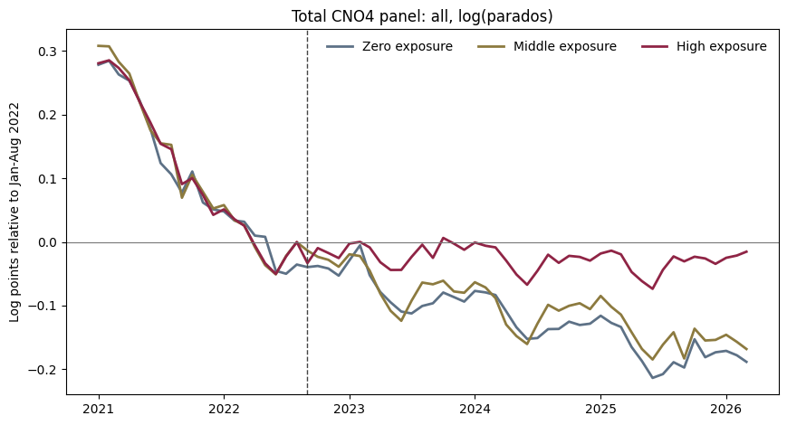

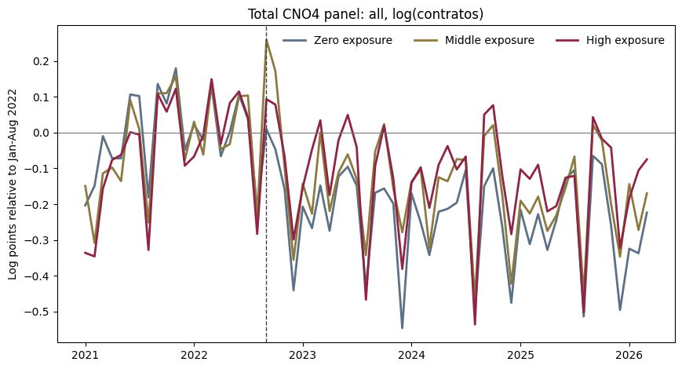

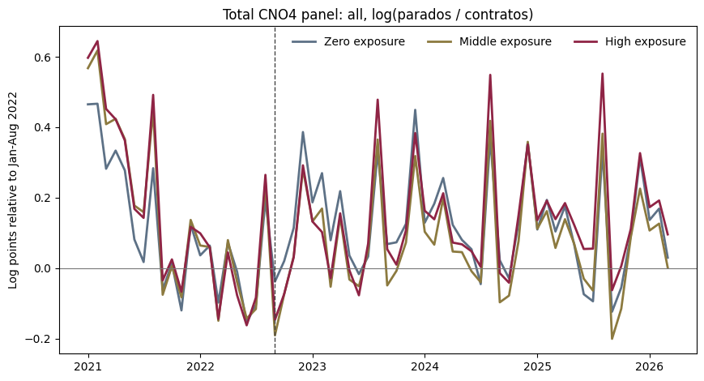

The unemployment-count trajectory shows a relative post-2022 divergence for high-exposure occupations. The contracts trajectory also rises for high-exposure occupations, which is inconsistent with a simple story in which AI exposure only reduces labor demand. The ratio figure should be read cautiously because `parados / contratos` is not a labor-force denominator, but it helps summarize whether unemployment counts are moving faster than contracting activity.

#### Age Panels

Indexed age-panel figures were generated for each age group and each outcome. The files are:

- `output/figures/figure_memo_v1_indexed_age_lt18_ln_parados.png`
- `output/figures/figure_memo_v1_indexed_age_18_24_ln_parados.png`
- `output/figures/figure_memo_v1_indexed_age_25_29_ln_parados.png`
- `output/figures/figure_memo_v1_indexed_age_30_39_ln_parados.png`
- `output/figures/figure_memo_v1_indexed_age_40_44_ln_parados.png`
- `output/figures/figure_memo_v1_indexed_age_gt44_ln_parados.png`
- analogous files for `ln_contratos` and `ln_parados_contratos`.

Representative age figures:

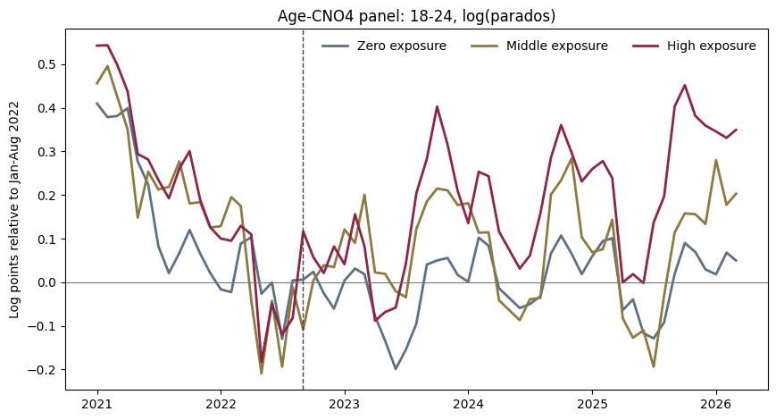

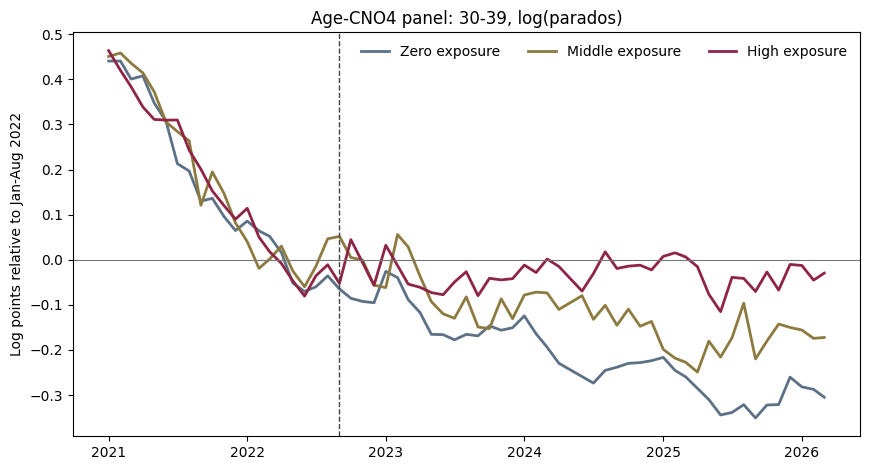

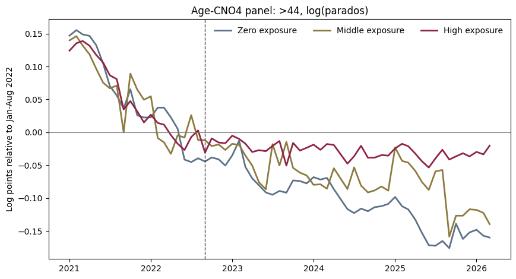

The descriptive age patterns motivate formal age heterogeneity analysis. The strongest simple DiD unemployment-count estimate later appears among workers aged 30-39, not among the youngest age groups.

### 2.3 Descriptive Statistics: AI Exposure Measure

#### Exposure Distribution

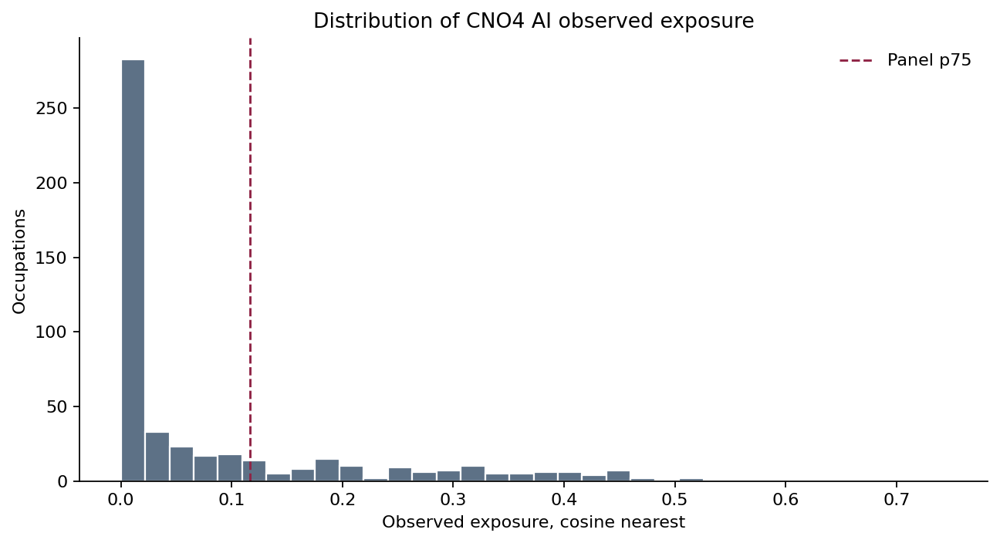

The 75th percentile threshold in the main panel is 0.1169. Occupations above this threshold are classified as high exposure in the binary treatment definition; occupations with exposure equal to zero are controls.

#### Within-CNO2 Variation

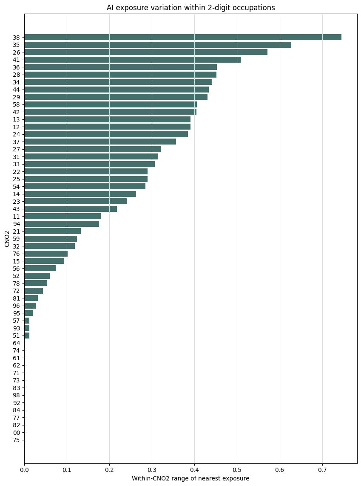

Within-CNO2 exposure variation matters because the preferred robustness specification absorbs CNO2-by-month fixed effects. The exposure measure has meaningful within-family variation:

- 62 CNO2 families.
- 55 CNO2 families with at least two CNO4 occupations.
- 22 CNO2 families with within-family exposure range above 0.25.
- 25 CNO2 families containing both zero-exposure and high-exposure CNO4 occupations.

Largest within-CNO2 exposure ranges:

| CNO2 | CNO4 count | Min | Max | Range | Highest-exposure occupation |
|---|---:|---:|---:|---:|---|
| 38 | 8 | 0.000 | 0.745 | 0.745 | Programadores informaticos |
| 35 | 10 | 0.000 | 0.628 | 0.628 | Agentes y representantes comerciales |
| 26 | 13 | 0.000 | 0.572 | 0.572 | Analistas financieros |
| 41 | 6 | 0.000 | 0.510 | 0.510 | Empleados de oficina de servicios estadisticos, financieros y bancarios |
| 36 | 10 | 0.000 | 0.453 | 0.453 | Asistentes de direccion y administrativos |

This confirms that CNO2-by-month fixed effects do not mechanically absorb all treatment variation. However, some important CNO2 families have few or no zero-exposure controls, so within-family estimates should still be treated as diagnostics.

#### High-Exposure Occupations and Match Validation

The most exposed CNO4 occupations are substantively plausible:

| Rank | CNO4 | Occupation | Exposure |
|---:|---|---|---:|
| 1 | 3820 | Programadores informaticos | 0.745 |
| 2 | 4301 | Grabadores de datos | 0.671 |
| 3 | 3510 | Agentes y representantes comerciales | 0.628 |
| 4 | 2613 | Analistas financieros | 0.572 |
| 5 | 2719 | Analistas y disenadores de software y multimedia | 0.520 |
| 6 | 4113 | Empleados de oficina de servicios estadisticos, financieros y bancarios | 0.510 |
| 7 | 2729 | Especialistas en bases de datos y redes informaticas | 0.486 |
| 8 | 3814 | Tecnicos de la web | 0.480 |
| 9 | 3812 | Tecnicos en asistencia al usuario de tecnologias de la informacion | 0.469 |
| 10 | 2652 | Profesionales de relaciones publicas | 0.453 |

The high-exposure occupations include many occupations that would be expected to be substantially affected by recent advances in generative AI: programming, data entry, finance, software analysis, database and web work, office services, and communications occupations. The exposure match diagnostics are mostly reassuring: among 124 validation-queue rows, 123 are flagged `ok` and 1 is flagged `low_similarity`. This supports using the measure for descriptive and econometric work, though it does not solve the identification problem.

## 3. Treatment Definition

The main binary treatment definition follows the preliminary project design:

- Treated: `observed_exposure_cosine_nearest > p75`.
- Control: `observed_exposure_cosine_nearest == 0`.
- Middle-exposure occupations are excluded from binary DiD models.
- Threshold: 0.1169.
- Event month: September 2022.
- Post period: months after September 2022, so post starts in October 2022.

Alternative treatment definitions used in robustness checks include top-decile treatment, cosine-weighted exposure, random-forest exposure, continuous exposure per 10 percentage points, and alternative post dates closer to ChatGPT release, including November 2022, December 2022, and January 2023.

## 4. Empirical Methods

### 4.1 Two-Way Fixed Effects

The baseline TWFE model is:

```text
Y_it = beta * (HighExposure_i x Post_t) + alpha_i + gamma_t + epsilon_it
```

where `Y_it` is an occupation-month outcome, `alpha_i` are CNO4 fixed effects, `gamma_t` are year-month fixed effects, and standard errors are clustered by CNO4. The coefficient `beta` is the post-2022 difference between high-exposure and zero-exposure occupations relative to their pre-period difference.

The key identification assumption is parallel trends: absent the AI diffusion shock, high-exposure and zero-exposure occupations would have followed the same outcome path after conditioning on fixed effects. The event-study evidence below shows that this assumption is problematic in the baseline design.

Additional specifications absorb broader occupation-family shocks:

| Specification family | Fixed effects | Purpose |
|---|---|---|
| CNO2-month FE | CNO4 FE and CNO2-by-month FE | Compare high and zero occupations within the same two-digit occupation family and month. |
| CNO2-month FE, restricted | Same, but restricted to CNO2 groups with high and zero occupations | Focus on CNO2 families that provide explicit within-family identifying variation. |
| CNO1-month FE | CNO4 FE and CNO1-by-month FE | Absorb broader one-digit occupation-family monthly shocks. |
| CNO1-month FE, restricted | Same, restricted to CNO1 groups with high and zero occupations | Focus on broad occupation groups with identifying variation. |

For province-CNO4 specifications, province-by-month fixed effects are included to absorb geographic labor-market shocks.

### 4.2 Synthetic Difference-in-Differences

The synthetic DiD exercises construct a treated aggregate from high-exposure occupations and a donor pool from zero-exposure occupations. The estimator chooses donor weights so that the weighted zero-exposure donor path matches the treated path in the pre-period, and then compares treated and synthetic outcomes in the post period. The implemented SDID-style estimator also uses time weights to emphasize pre-periods that are most informative for post-period counterfactual prediction.

Conceptually, the SDID estimand is:

```text
tau_SDID = sum_t omega_t [Ybar_treated,t - sum_j lambda_j Y_control,j,t]
```

where `lambda_j` are unit weights and `omega_t` are time weights. The advantage relative to TWFE is that SDID relaxes the requirement that all zero-exposure occupations are equally informative controls. The cost is that the method can overfit when the donor pool is large relative to the number of pre-periods, especially in the province-CNO4 panel.

## 5. Results

### 5.1 Baseline Results

#### A. TWFE Results

The simple TWFE estimates are positive for unemployment counts and contracts:

| Specification | Outcome | Estimate | SE | Approx. effect | Interpretation |
|---|---|---:|---:|---:|---|
| Main DiD | `ln_parados` | 0.089 | 0.021 | +9.3% | Positive post gap for high-exposure occupations. |
| CNO4 trends | `ln_parados` | -0.003 | 0.012 | -0.3% | Effect disappears with occupation trends. |
| `log(parados + 1)` | `ln_parados_p1` | 0.094 | 0.021 | +9.8% | Similar to baseline. |
| Weighted by pre parados | `ln_parados` | 0.043 | 0.026 | +4.4% | Smaller and marginal. |
| Event Nov 2022 | `ln_parados` | 0.091 | 0.021 | +9.5% | Timing choice not decisive. |
| Top decile | `ln_parados` | 0.080 | 0.031 | +8.3% | Positive but noisier. |
| Continuous exposure | `ln_parados` | 0.027 | 0.007 | +2.7% per 10pp | Positive gradient. |
| Contracts outcome | `ln_contratos_p1` | 0.123 | 0.030 | +13.1% | Contracts rise in exposed occupations. |

The contracts result is important. A pure AI-displacement interpretation would predict higher unemployment and lower hiring. Instead, both unemployment and contracts rise in high-exposure occupations. This pattern is more consistent with churn, reallocation, or occupation-family dynamics than with direct job destruction.

#### Dynamic Effects

Baseline event-study output:

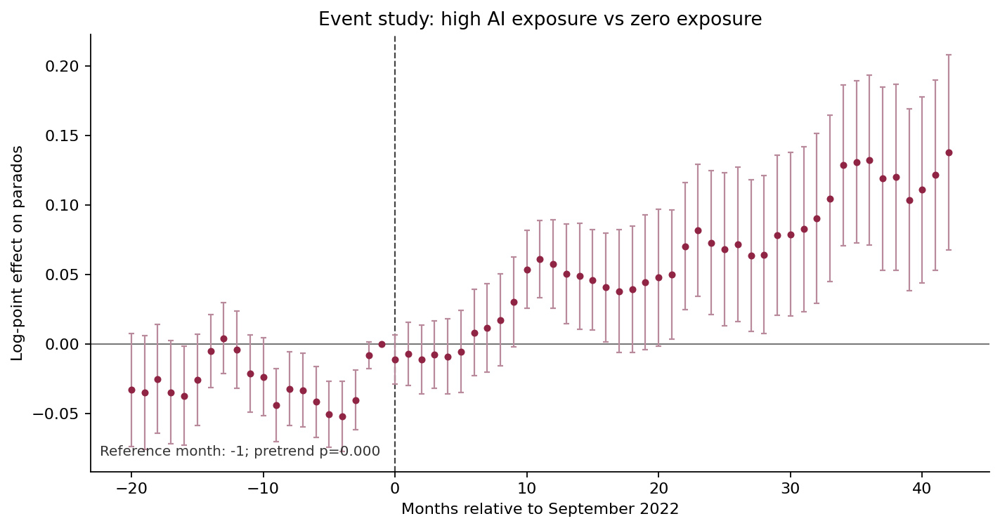

The original event study has a joint pretrend Wald p-value of 2.1e-08 for the null that all pre-period event coefficients equal zero. The current Python output does not separately store a valid joint test that all placebo coefficients are equal to each other; this should be added in the next estimation pass if the paper requires both placebo diagnostics. The existing all-zero placebo test already provides strong evidence against clean parallel trends.

Province-CNO4 binary event study:

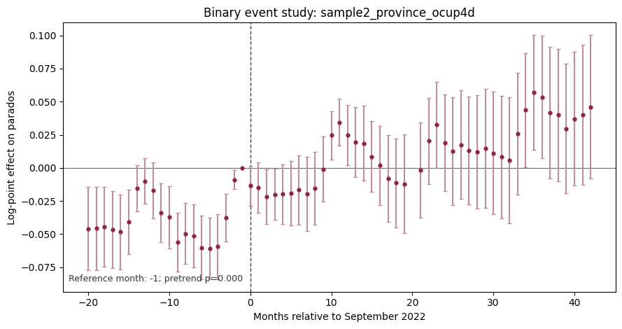

The province-CNO4 event-study pretrend p-value is 6.83e-11, again rejecting parallel pretrends.

Continuous-treatment event study for the total panel:

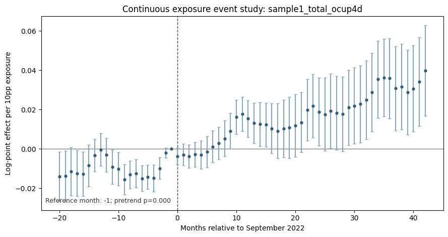

The continuous-treatment event-study p-value for pretrends is 8.34e-07 in the total panel. The continuous design is useful because it avoids the sharp high-versus-zero dichotomy, but it does not solve the pretrend problem.

CNO2-by-month FE event study:

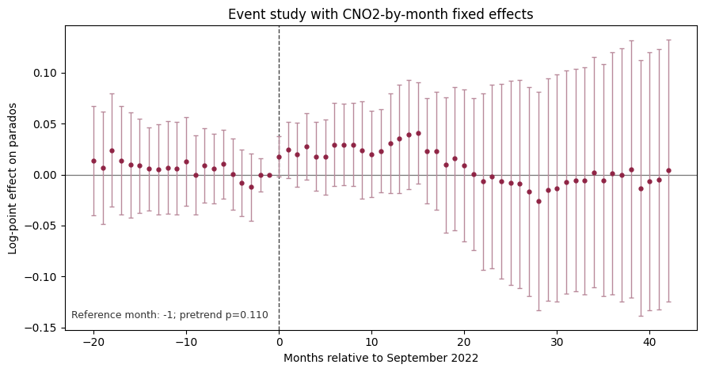

The CNO2-by-month event study improves the pretrend diagnostic substantially: the pretrend p-value rises to 0.110. But the post coefficient also becomes essentially zero:

| Specification | Outcome | Estimate | SE | p-value |
|---|---|---:|---:|---:|
| Binary, CNO2-month FE | `ln_parados` | 0.002 | 0.044 | 0.966 |
| Binary, CNO2-month FE | `ln_parados_p1` | 0.010 | 0.044 | 0.823 |
| Binary, CNO2-month FE | `ln_contratos_p1` | 0.040 | 0.044 | 0.357 |
| Continuous, CNO2-month FE | `ln_parados` | -0.001 | 0.011 | 0.915 |
| Continuous, CNO2-month FE | `ln_contratos_p1` | 0.013 | 0.014 | 0.355 |

This is the most important identification result in the project: once broad two-digit occupation-family monthly shocks are absorbed, the unemployment-count effect disappears.

Treated-group linear trends also point in the same direction. In the continuous model, adding CNO4-specific linear trends changes the `ln_parados` estimate from 0.027 to 0.000. The corresponding contracts effect remains positive, about 0.030 log points per 10pp exposure, suggesting that contracts are less sensitive to the same trend adjustment than unemployment counts.

#### TWFE Summary

The TWFE evidence supports a descriptive association but not a credible causal effect. The positive baseline survives mechanical timing and exposure variants, but it fails the strongest identification checks: pretrends reject, occupation trends remove the effect, and CNO2-by-month fixed effects remove the effect while improving pretrends.

#### B. SDID Results

Synthetic DiD and synthetic control estimates are positive in all feasible panels:

| Design | Outcome | SDID ATT | Synthetic control ATT | Uniform DID | SDID approx. effect |
|---|---|---:|---:|---:|---:|
| Total CNO4 | `ln_parados` | 0.072 | 0.099 | 0.091 | +7.4% |
| Province-CNO4 | `ln_parados_p1` | 0.113 | 0.110 | 0.052 | +11.9% |
| Age 30-39 CNO4 | `ln_parados` | 0.125 | 0.092 | 0.169 | +13.3% |

Synthetic path figures:

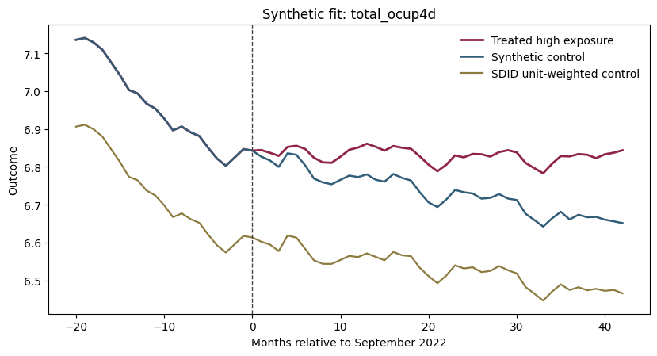

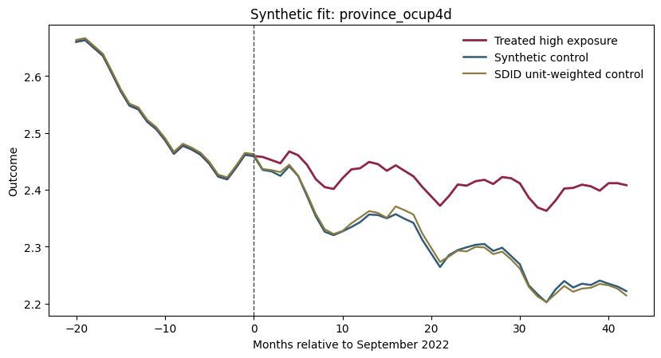

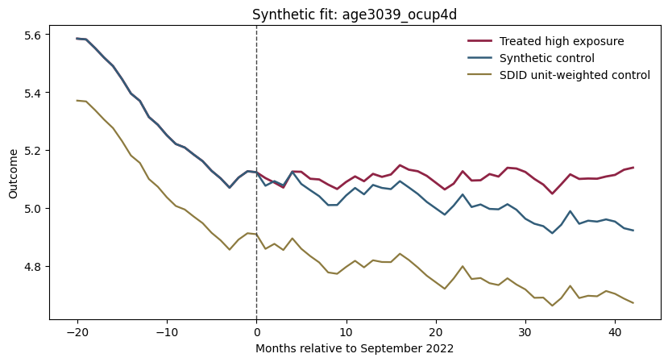

The SDID and synthetic-control exercises complement the TWFE evidence by showing that positive post gaps remain after reweighting zero-exposure donor units to match treated pre-period paths. However, the donor pool is rich relative to the number of pre-periods, especially in the province-CNO4 panel, so pre-period fit can be very tight and overfitting risk is real. These estimates therefore do not overturn the CNO2-by-month finding; rather, they show that the descriptive post gap can be reproduced under synthetic weighting.

### 5.2 Heterogeneity by Age

Simple high-versus-zero TWFE estimates by age group:

| Age group | Estimate on `ln_parados` | SE | Approx. effect | p-value |
|---|---:|---:|---:|---:|
| <18 | 0.049 | 0.059 | +5.0% | 0.402 |
| 18-24 | 0.079 | 0.039 | +8.3% | 0.044 |
| 25-29 | 0.070 | 0.036 | +7.3% | 0.048 |
| Under 30 | 0.050 | 0.036 | +5.2% | 0.158 |
| 30-39 | 0.181 | 0.035 | +19.8% | <0.001 |
| 40-44 | 0.096 | 0.030 | +10.1% | 0.001 |
| >44 | 0.074 | 0.019 | +7.7% | <0.001 |

The strongest simple unemployment-count estimate is among workers aged 30-39. But the age 30-39 effect is not robust to CNO2-by-month fixed effects:

| Outcome | Estimate | SE | p-value |
|---|---:|---:|---:|
| `ln_parados` | 0.024 | 0.067 | 0.718 |
| `ln_parados_p1` | 0.018 | 0.062 | 0.774 |
| `ln_contratos_p1` | 0.026 | 0.041 | 0.530 |

Age 30-39 CNO2-month event study:

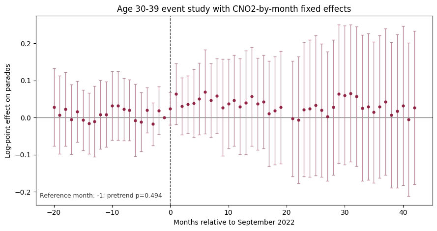

The pretrend p-value in this age 30-39 CNO2-month event study is 0.494. This reinforces the main interpretation: the age 30-39 signal in the simple model appears to be driven by occupation-family dynamics rather than within-family AI exposure variation.

### 5.3 Heterogeneity by Gender

Simple gender-CNO4 estimates are positive for both men and women:

| Gender | Estimate on `ln_parados` | SE | Approx. effect | p-value |
|---|---:|---:|---:|---:|
| Men | 0.086 | 0.022 | +9.0% | <0.001 |
| Women | 0.069 | 0.023 | +7.1% | 0.003 |

The combined gender-CNO4 event study is:

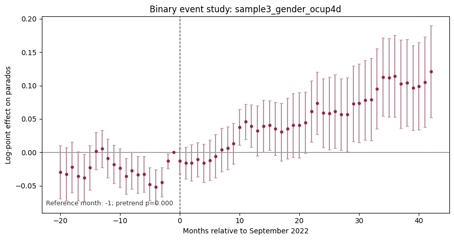

The combined gender-CNO4 pretrend p-value is 7.99e-05. The current Python outputs do not yet contain separate male-only and female-only event-study figures. The gender-specific point estimates suggest broadly similar positive associations, somewhat larger for men, but the same identification concerns from the pooled event study apply.

### 5.4 Additional Robustness Checks

#### CNO2 Family Diagnostics

The FWL decomposition shows that the original positive coefficient is heavily influenced by CNO2 family dynamics. Focus families include:

| CNO2 | Occupations | Treated | Zero exposure | Note |
|---|---:|---:|---:|---|
| 27 | 8 | 8 | 0 | Important contributor, but no zero-exposure controls. |
| 38 | 8 | 5 | 2 | ICT technicians; estimable but small control group. |
| 24 | 42 | 6 | 14 | STEM professionals; better within-family comparison. |
| 59 | 12 | 3 | 8 | Positive within-family result, less obvious AI mechanism. |

Within-family event-study figures:

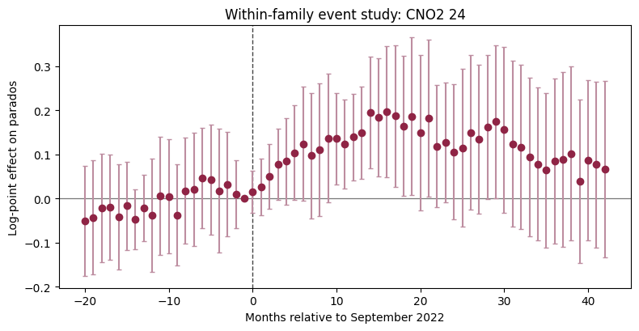

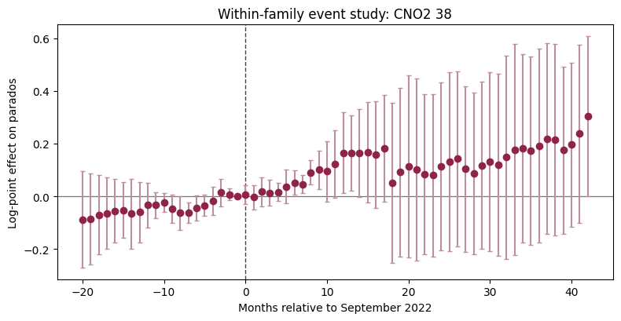

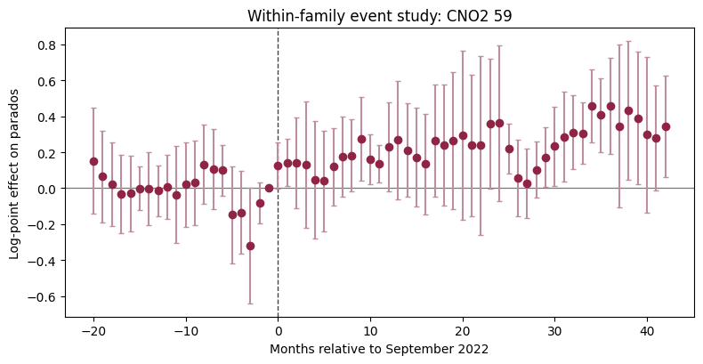

The within-family DiD estimates are mixed and often imprecise. CNO2 59 is positive and statistically precise, but it has only 11 clusters and is not an obvious AI-exposure mechanism. CNO2 38 and 24 are substantively relevant but imprecise. These results are best used to guide qualitative validation rather than to claim a broad causal effect.

#### Denominator Proxy

The SEPE data do not contain a true employment or labor-force denominator at CNO4-month level. A CNO2-quarter proxy using SEPE registered unemployment and INE EPA occupied workers yields:

| Specification | Outcome | Estimate | SE | p-value |
|---|---|---:|---:|---:|
| CNO2 rate proxy | `ln_rate_proxy` | 0.028 | 0.011 | 0.013 |
| CNO2 rate proxy + CNO2 trends | `ln_rate_proxy` | -0.005 | 0.008 | 0.536 |

The denominator proxy repeats the central pattern: a positive simple association becomes approximately zero after trend adjustment.

#### HonestDiD Sensitivity

HonestDiD sensitivity for the original event-study first-year average:

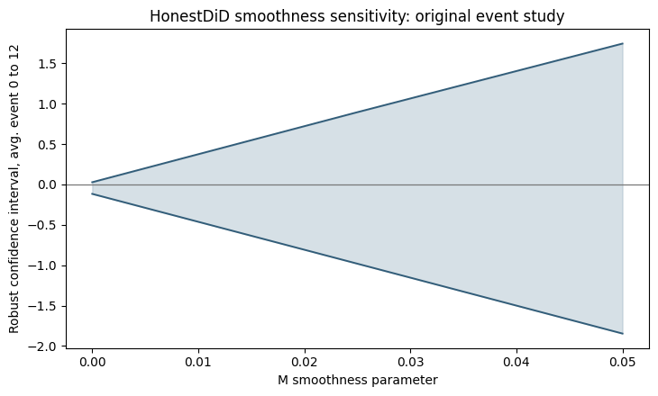

Smoothness sensitivity intervals:

| M | Lower | Upper |
|---:|---:|---:|
| 0.000 | -0.116 | 0.028 |
| 0.025 | -0.981 | 0.896 |
| 0.050 | -1.846 | 1.745 |

Even under the standard local event-window calculation, the first-year average includes zero. Under HonestDiD relaxations, the intervals are wide and include zero. This further weakens a causal interpretation of the original event-study graph.

## 6. Identification Assessment

The project has a transparent empirical design, but the current identification evidence is not strong enough to support a causal claim that AI exposure increased unemployment.

Parallel trends are the central weakness. The original binary event study rejects the null that all pre-period coefficients are zero. The province, gender, age, and continuous-treatment event studies also reject pretrends. The one specification that materially improves the pretrend diagnostic, CNO2-by-month fixed effects, also removes the estimated unemployment effect.

Composition effects are also important. High-exposure occupations are not random occupations: they are concentrated in ICT, finance, administration, sales, office, and professional occupations. These families may have experienced post-2022 changes unrelated to AI, including business-cycle recovery, sectoral shifts, administrative reporting changes, or occupational reclassification.

Within-group identifying variation exists but is uneven. Many CNO2 families contain both high- and zero-exposure occupations, but some key families do not. CNO2 27, for example, has no zero-exposure controls in the focus comparison. This limits the interpretability of within-family estimates.

Potential confounding shocks remain plausible. The post period begins after the pandemic recovery phase and overlaps with changes in inflation, sectoral demand, remote work, digitalization, and firm hiring behavior. AI exposure may proxy for occupations already undergoing structural change.

TWFE and SDID agree on the descriptive post gap but not on identification credibility. TWFE, SDID, and synthetic control all recover positive post-period differences under broad comparisons. But CNO2-by-month fixed effects and HonestDiD sensitivity show that the positive difference is not robust to stronger assumptions about comparison quality.

Overall credibility assessment:

| Evidence | Interpretation |
|---|---|
| Baseline TWFE positive | Suggestive descriptive association. |
| Contracts also positive | Points to churn/reallocation, not pure displacement. |
| Event-study pretrends fail | Major threat to causal interpretation. |
| Occupation trends remove effect | Baseline is sensitive to differential trends. |
| CNO2-month FE removes effect | Broad occupation-family shocks likely drive the simple gap. |
| SDID/SC positive | Descriptive gap persists under synthetic weighting. |
| HonestDiD includes zero | Original event-study average is not robust. |

## 7. Bottom Line

The empirical evidence points to four conclusions.

First, high-AI-exposure occupations show a positive post-2022 relative divergence in registered unemployment counts in simple high-versus-zero DiD models. The baseline estimate is about +9.3 percent.

Second, high-exposure occupations also show positive contract growth. This makes the labor-market interpretation more subtle: the pattern is more consistent with reallocation or churn than with a simple AI-induced collapse in labor demand.

Third, the positive unemployment association is not robust to the strongest identification checks. Event-study pretrends fail, occupation-specific trends remove the effect, CNO2-by-month fixed effects remove the effect, and HonestDiD sensitivity intervals include zero.

Fourth, SDID and synthetic-control estimates are useful descriptive robustness checks but do not resolve the main identification problem. They recover positive post gaps, but those gaps may still reflect occupation-family dynamics rather than causal effects of AI exposure.

The strongest current answer to the research question is therefore:

> The data show a robust descriptive post-2022 divergence for high-exposure occupations, but not credible causal evidence that AI exposure increased unemployment. The next stage should prioritize true employment denominators, gender-specific event studies, ratio-outcome regressions, and within-CNO2 validation in families with meaningful treated and zero-exposure occupations.

## Output Map

Main memo assets:

- `output/figures/figure_memo_v1_indexed_total_all_ln_parados.png`
- `output/figures/figure_memo_v1_indexed_total_all_ln_contratos.png`
- `output/figures/figure_memo_v1_indexed_total_all_ln_parados_contratos.png`
- `output/figures/figure_memo_v1_indexed_age_*.png`
- `output/tables/table_memo_v1_indexed_inputs_total.csv`
- `output/tables/table_memo_v1_indexed_inputs_age.csv`

Main result tables:

- `output/tables/table_regression_specifications.csv`
- `output/tables/table_event_study_coefficients.csv`
- `output/tables/table_v1_cno2_month_fe_specifications.csv`
- `output/tables/table_v1_cno2_month_fe_event_study.csv`
- `output/tables/table_next_step_subgroup_heterogeneity.csv`
- `output/tables/table_recommended_age3039_cno2_month_fe.csv`
- `output/tables/table_synthetic_did_control_results.csv`
- `output/tables/table_recommended_honestdid_smoothness.csv`
- `output/tables/table_exposure_variation_within_cno2.csv`
