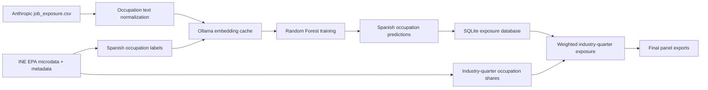

## Summary

Build a reproducible Python pipeline that downloads Anthropic occupation exposure data and Spanish EPA microdata, embeds occupation labels with local Ollama, trains a Random Forest exposure model on Anthropic occupations, predicts exposure for Spanish occupations, stores occupation-level predictions, and aggregates exposure by Spanish industry and quarter.

---

## Problem Frame

The project aims to reproduce Anthropic-style occupation AI exposure analysis for Spain. Anthropic publishes `job_exposure.csv` in the `labor_market_impacts` folder of the `Anthropic/EconomicIndex` Hugging Face dataset. Spanish labor market composition comes from INE EPA microdata, where `OCUP1` identifies occupation and `ACT1` identifies industry. The target output is a tidy panel with industry code `cnae`, quarter, and `observed_exposure_cnae`, computed as an occupation-weighted exposure average within each industry-quarter cell.

The repo is currently empty and not initialized as a git repository. The implementation should therefore create the project structure, initialize reproducibility conventions, and only then commit/push once a public GitHub repo or remote is available.

---

## Requirements

- R1. Download Anthropic `job_exposure.csv` from Hugging Face.
- R2. Download INE EPA microdata and required metadata/codebooks for available quarters.
- R3. Use a local Ollama embedding model to vectorize occupation titles.
- R4. Cache embeddings so repeated runs skip already embedded titles for the same model and text normalization.
- R5. Train a Random Forest model with `observed_exposure` as target and embedding dimensions as predictors.
- R6. Predict `observed_exposure` for Spanish `OCUP1` occupation titles using the same embedding model.
- R7. Store Spanish occupation-level predicted exposure in a database.
- R8. Aggregate exposure by industry-quarter using occupation frequencies within each `ACT1` industry cell as weights.
- R9. Produce final tidy data with `cnae`, `quarter`, and `observed_exposure_cnae`.
- R10. Provide a single master script that runs download, processing, modeling, prediction, DB writes, and final exports.
- R11. Avoid virtual environments; document direct dependency installation and usage.
- R12. Document every pipeline step in `README.md`.

---

## Assumptions

- The first implementation will use Python scripts plus SQLite, not a heavier workflow engine.
- The embedding model name will be configurable, defaulting to one installed Ollama embedding model discovered locally.
- EPA microdata should default to modern CNO-2011 occupation coding and CNAE-2009 industry coding for comparability, with explicit handling for 2026 dual CNAE coding.
- Occupation labels for Spanish `OCUP1` will come from INE record-layout/value metadata or a checked-in mapping derived from it, not manually typed ad hoc.
- If INE download URLs are dynamic, the downloader may maintain a small manifest file that maps quarters to stable file URLs discovered from the INE page.
- Random Forest will be the baseline model; model diagnostics will be reported, but causal validation is out of scope.
- Public GitHub push requires either an existing remote or permission to create/configure one during implementation.

---

## Scope Boundaries

### In Scope

- End-to-end local batch pipeline.
- Persistent raw-data cache, processed outputs, embeddings cache, trained model artifact, SQLite DB, and CSV/parquet final panel.
- Robust README with methodology, data provenance, setup, Ollama config, command usage, output schemas, and known caveats.
- Basic tests for parsing, embedding cache behavior, model input/output contracts, and aggregation weights.

### Deferred to Follow-Up Work

- Alternative models beyond Random Forest, such as ridge, XGBoost, or neural regressors.
- Formal occupation crosswalk validation between SOC/O*NET and CNO families.
- Dashboard or visualization app.
- Cloud execution and scheduled updates.

### Out of Scope

- Estimating worker-level exposure or individual-level causal effects.
- Publishing INE raw microdata into the GitHub repo.
- Reproducing Anthropic's full task-level economic index beyond `job_exposure.csv`.

---

## Key Technical Decisions

| Decision | Rationale |
|---|---|
| Use Python + pandas + scikit-learn + requests + SQLite | Fits small/medium batch data, avoids virtualenv requirement, easy for local Windows use. |
| Use Ollama HTTP API for embeddings | Keeps embeddings local and model-configurable without adding cloud credentials. |
| Cache embeddings by normalized text + model name + embedding dimension | Prevents stale reuse across different Ollama models or changed preprocessing. |
| Store canonical outputs in SQLite and export analysis tables to `data/processed/` | DB supports reproducible joins and inspection; flat exports support downstream analysis. |
| Keep raw data out of git via `.gitignore` | INE microdata can be large and should be downloaded reproducibly instead of committed. |
| Use `OCUP1` and `ACT1` as core EPA fields | Matches user-specified occupation and industry variables. |
| Use observed employment records only for weighting | Exposure by industry should reflect job composition; inactive/unemployed records should not enter industry job shares. |
| Include quarter metadata from downloaded file identity | Required for industry-quarter panel and reproducible refreshes. |

---

## High-Level Technical Design



The implementation should separate download, parsing, embedding, modeling, database writes, and aggregation into importable modules. `main.py` should orchestrate them in sequence and expose flags for model name, quarter range, refresh behavior, and output location.

---

## Proposed Output Structure

```text
README.md
requirements.txt
main.py
src/
  config.py
  download_anthropic.py
  download_ine.py
  ine_metadata.py
  embeddings.py
  model.py
  database.py
  aggregate.py
  utils.py
tests/
  test_embeddings.py
  test_model.py
  test_ine_metadata.py
  test_aggregate.py
data/
  raw/
  interim/
  processed/
  cache/
models/
```

`data/` and `models/` should be gitignored except for small manifest/schema files if needed.

---

## Implementation Units

### U1. Project Scaffolding and Configuration

**Files:** `README.md`, `requirements.txt`, `.gitignore`, `main.py`, `src/config.py`

**Work:** Create a simple Python package-like layout without virtualenv assumptions. Centralize paths, source URLs, Ollama host/model, quarter selection, random seed, and database path.

**Tests:** None required beyond import smoke tests in later units.

**Verification:** `main.py --help` or equivalent shows runnable entry point and documented options.

### U2. Anthropic Data Downloader

**Files:** `src/download_anthropic.py`, `tests/test_model.py`

**Work:** Download `job_exposure.csv` from Hugging Face raw URL, cache it under `data/raw/anthropic/`, validate required columns including occupation code/title and `observed_exposure`, and expose a clean DataFrame loader.

**Test Scenarios:**

- Happy path: fixture CSV with required columns loads and preserves row count.
- Error path: missing `observed_exposure` raises clear validation error.
- Edge case: duplicate occupation titles are retained for training unless duplicate keys are exact duplicates.

**Verification:** Downloader can produce a validated Anthropic training table.

### U3. INE EPA Downloader and Metadata Parser

**Files:** `src/download_ine.py`, `src/ine_metadata.py`, `tests/test_ine_metadata.py`

**Work:** Download INE microdata files and layout/value metadata. Parse or maintain mappings for `OCUP1` occupation labels and `ACT1` industry values. Extract quarter identifiers from file names or manifest rows.

**Test Scenarios:**

- Happy path: fixture metadata maps sample `OCUP1` codes to Spanish labels.
- Happy path: fixture microdata yields `quarter`, `OCUP1`, `ACT1`, and person/job weight fields.
- Error path: unsupported quarter or missing layout file produces actionable error.
- Edge case: 2026 dual CNAE coding is either mapped to selected `ACT1` convention or flagged.

**Verification:** One downloaded quarter can be parsed into a normalized EPA table.

### U4. Ollama Embedding Client and Cache

**Files:** `src/embeddings.py`, `tests/test_embeddings.py`

**Work:** Implement local Ollama embedding calls, text normalization, batch processing, retry/timeout behavior, and persistent cache keyed by model + normalized text. Store vectors in SQLite or parquet/JSONL cache with enough metadata to detect model changes.

**Test Scenarios:**

- Happy path: mock Ollama response returns vector with expected dimension.
- Edge case: repeated text hits cache and does not call Ollama again.
- Error path: Ollama unavailable raises message naming host/model and recovery steps.
- Integration: different model names create distinct cache entries.

**Verification:** Anthropic and Spanish occupation labels can be embedded once and reused on rerun.

### U5. Exposure Model Training

**Files:** `src/model.py`, `tests/test_model.py`

**Work:** Train Random Forest regressor on Anthropic embeddings. Use reproducible random seed, train/test split or cross-validation, basic diagnostics, and model artifact persistence under `models/`.

**Test Scenarios:**

- Happy path: tiny synthetic embedding matrix trains and predicts numeric exposure.
- Edge case: target with missing values is rejected or filtered with logged count.
- Error path: embedding dimension mismatch raises clear error.
- Integration: saved model reloads and produces same predictions for fixed inputs.

**Verification:** Training outputs model artifact plus metrics file.

### U6. Spanish Occupation Exposure Prediction and DB Storage

**Files:** `src/database.py`, `src/model.py`, `tests/test_model.py`

**Work:** Predict exposure for each Spanish occupation label and store results in SQLite. Include occupation code, occupation title, embedding model, model version/hash, predicted exposure, and generation timestamp.

**Test Scenarios:**

- Happy path: sample occupation predictions write to DB and read back unchanged.
- Edge case: rerun with same model upserts instead of duplicating rows.
- Error path: prediction attempted before trained model exists yields clear error.

**Verification:** DB contains one current exposure row per Spanish occupation/model combination.

### U7. Industry-Quarter Aggregation

**Files:** `src/aggregate.py`, `tests/test_aggregate.py`

**Work:** Compute occupation shares within each `ACT1` by quarter, then weighted mean exposure. Use EPA person/job weight if available and configured; otherwise fall back to record counts with warning. Output `cnae`, `quarter`, `observed_exposure_cnae`, plus optional diagnostics such as employment count, occupation count, and coverage share.

**Test Scenarios:**

- Happy path: known sample weights produce expected weighted average.
- Edge case: industry-quarter with occupation missing exposure is handled by coverage reporting.
- Error path: zero total weight cell is skipped or flagged.
- Integration: multiple quarters produce sorted panel rows.

**Verification:** Final table has one row per industry-quarter cell with valid exposure and coverage metadata.

### U8. Master Orchestration and README

**Files:** `main.py`, `README.md`

**Work:** Wire the pipeline end to end. README must document data sources, commands, dependencies without virtualenv, Ollama setup, cache behavior, DB schema, outputs, methodology, limitations, and how to reproduce from clean checkout.

**Test Scenarios:**

- Integration: dry-run or fixture mode exercises all stages without network/Ollama.
- Error path: missing Ollama model or missing INE metadata surfaces clear next step.

**Verification:** A user can run one command to rebuild outputs after installing dependencies and starting Ollama.

### U9. GitHub Publication

**Files:** repository metadata only

**Work:** Initialize git if needed, commit implementation, configure a public GitHub remote, and push. Do not commit raw INE microdata, embedding cache, model binaries, or large outputs unless explicitly approved.

**Test Scenarios:** None.

**Verification:** Public GitHub URL exists and contains source code, tests, README, and lightweight manifests only.

---

## System-Wide Impact

- **Interaction graph:** `main.py` orchestrates downloaders, metadata parser, embedder, model trainer, DB writer, and aggregator.
- **Error propagation:** Each module should raise human-readable exceptions that name the stage, source, and recovery action.
- **State lifecycle risks:** Raw data cache, embedding cache, model artifact, and DB rows must be versioned enough to avoid mixing incompatible runs.
- **API surface parity:** CLI flags and README examples should match exactly.
- **Integration coverage:** Fixture-mode full run should prove module contracts without requiring network or Ollama.
- **Unchanged invariants:** Source data remains downloaded from official providers; generated raw data and caches remain out of git.

---

## Risks & Dependencies

| Risk | Likelihood | Impact | Mitigation |
|---|---:|---:|---|
| INE microdata URLs or page structure change | Medium | High | Use manifest fallback and document how to update URLs. |
| INE file encoding/layout differs by period | High | High | Parse layouts by period and keep tests for sample fixtures. |
| `OCUP1` occupation labels are coarse | Medium | Medium | Store predictions at available `OCUP1` granularity and document limitation. |
| Anthropic occupations are US-centric | High | Medium | Treat model as semantic transfer baseline, not validated Spanish exposure truth. |
| Embedding model unavailable locally | Medium | Medium | Configurable model, local detection, clear error messages. |
| Embedding dimension changes across models | Medium | High | Cache/model metadata checks enforce dimension compatibility. |
| Raw data accidentally committed | Medium | High | Strong `.gitignore` and explicit publication checklist. |

---

## Documentation / Operational Notes

`README.md` should include:

- Project goal and methodology in plain language.
- Data source links and exact files used.
- Dependency install command without virtualenv.
- Ollama setup, how to list embedding models, and how to choose one.
- Full command examples for complete run and fixture/dry run.
- Directory layout and cache behavior.
- SQLite table schemas.
- Final output schema for occupation and industry-quarter exposure.
- Explanation of weighting formula.
- Known limitations and reproducibility notes.
- GitHub publication notes explaining why raw data/caches are excluded.

---

## Sources & References

- Anthropic dataset folder: https://huggingface.co/datasets/Anthropic/EconomicIndex/tree/main/labor_market_impacts
- Anthropic `job_exposure.csv`: https://huggingface.co/datasets/Anthropic/EconomicIndex/blob/main/labor_market_impacts/job_exposure.csv
- INE EPA results and microdata page: https://ine.es/dyngs/INEbase/es/operacion.htm?c=Estadistica_C&cid=1254736176918&menu=resultados&secc=1254736030639&idp=1254735976595
- Ollama embeddings API docs: https://github.com/ollama/ollama/blob/main/docs/api.md
